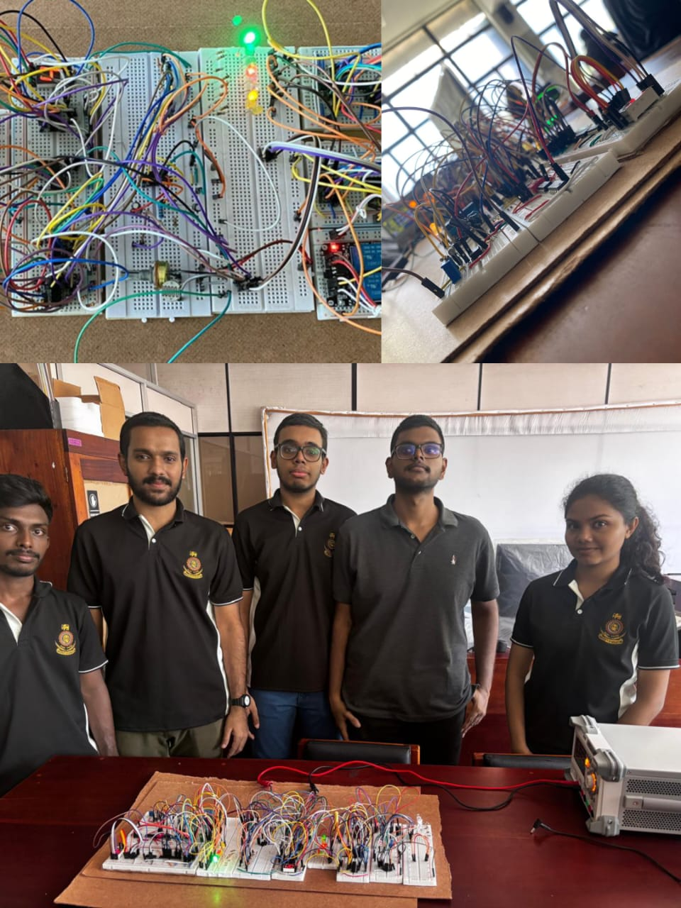

# Advanced Light Intensity Indicator (ALII)

A discrete analog-and-digital hardware project developed for the Digital Signal Processing module. The **Advanced Light Intensity Indicator (ALII)** senses ambient light, filters unwanted electrical noise, converts the conditioned analog signal to a 3-bit digital level, and displays light intensity from **0 to 7**. It also provides stable-light detection and time-averaged light intensity without using microcontrollers or programmable ICs.

## Project Overview

The ALII system was designed to monitor ambient light intensity and provide three useful outputs:

- **Instantaneous light intensity**
- **Stable light intensity**, where short temporary fluctuations are ignored
- **Average light intensity** over an adjustable time period

The project combines analog signal conditioning, ADC concepts, digital logic, sequential circuits, counters, adders, flip-flops, timing circuits, and seven-segment display logic.

## Main Requirements

The original project specification required the system to:

1. Sense ambient light using an **LDR**.
2. Suppress unwanted **50-100 Hz power-line interference** using an analog low-pass or notch filter.
3. Display the measured light level on a seven-segment display from **0 to 7**.
4. Update the stable-light output only after the light level remains stable for an adjustable period of **30-300 s**.
5. Allow the stability feature to be enabled or disabled using a switch.
6. Calculate and display the **average light intensity** over an adjustable period of **300-900 s**.
7. Provide a push button to reset the averaging function.
8. Implement the design without programmable ICs or pre-built task-specific ICs; gate ICs and flip-flops are permitted.

## Implemented System

### 1. Light Sensing

An **LDR-based sensing circuit** converts changes in ambient light into an analog voltage. This voltage is the input to the signal-conditioning stage.

### 2. Analog Low-Pass Filtering

A low-pass filter is used before digital processing to reduce unwanted power-line noise and harmonics. This improves the stability of the light-intensity signal and prevents false changes caused by electrical interference.

### 3. Flash ADC

The conditioned analog voltage is converted into a digital representation using a **Flash ADC architecture**. A resistor ladder creates reference voltage levels, while comparators determine the range in which the input signal lies.

The output is encoded into a **3-bit digital value**, representing eight light-intensity levels:

| Digital Level | Displayed Value |
|---|---:|
| 000 | 0 |
| 001 | 1 |
| 010 | 2 |
| 011 | 3 |
| 100 | 4 |
| 101 | 5 |
| 110 | 6 |
| 111 | 7 |

### 4. Instantaneous Light Intensity Display

The current 3-bit light level is converted to the required seven-segment signals and displayed as a number from **0 to 7**.

### 5. Stability Detection

To avoid displaying temporary variations, the stable-light section waits until the measured level remains unchanged for a selected duration. The intended adjustment range is **30-300 s**.

The implemented logic uses discrete timing and sequential hardware, including relays/logic and flip-flops, rather than a programmable controller. Once the input remains stable for the selected time, the stable value is allowed to update.

### 6. Time-Based Averaging

The project also calculates the average light level over an adjustable observation period. The required range is **300-900 s**.

Digital counters, adders, and flip-flops are used to accumulate light-level information over time and obtain the average value. A reset input allows the averaging process to be restarted.

### 7. Seven-Segment Displays

Separate seven-segment display outputs are used for the processed light-intensity information. The system represents values using the range **0-7**, matching the 3-bit digital level.

## System Flow

```text
Ambient Light
     |
     v
LDR Sensor
     |
     v
Analog Low-Pass Filter
     |
     v
Flash ADC
     |
     v
3-bit Light Level (0-7)
     |
     +---------------------> Instantaneous Display
     |
     +----> Stability Detection ----> Stable Light Display
     |
     +----> Time Averaging ---------> Average Light Display
```

## Design Constraints

- No microcontroller was used.
- No programmable IC was used.
- No pre-built IC that performs the complete required task was used.
- The design is based on analog components, comparators, logic gates, counters, adders, timing circuitry, relays, and flip-flops.

## Repository Structure

```text
Advanced-Light-Intensity-Indicator/
|
|-- README.md
|
|-- docs/
|   |-- ALII_Project_Summary.pdf
|   `-- Project_Requirements.pdf
|
|-- simulation/
|   `-- ALII_Final_Simulation.txt
|
`-- images/
    |-- final_breadboard.jpg
    |-- full_simulation.png
    |-- low_pass_filter.png
    |-- flash_adc.png
    |-- stability_detection.png
    |-- time_averaging.png
    `-- seven_segment_display.png
```

## Suggested Repository Images

Add clear screenshots/photos to the `images/` directory using the filenames above. They can then be shown in this README as follows:

```markdown



```

## Learning Outcomes

This project provided practical experience in:

- Analog and digital hardware design
- Breadboard implementation
- Analog signal conditioning
- Noise filtering
- Flash ADC design
- Comparator and resistor-ladder circuits
- Combinational and sequential logic
- Counters, adders, and flip-flops
- Timing and stability-detection circuits
- Seven-segment display logic
- Hardware and simulation troubleshooting
- Integrating several circuit blocks into one complete system

## Team Members

- Sethum Perera
- Thimeshi Nipunika
- Peranavan Kiritharan
- Maharajah Priyatharsan
- Sivarajah Banuharan

## Documentation

- `docs/Project_Requirements.pdf` - original project specification
- `docs/ALII_Project_Summary.pdf` - concise summary of the implemented project
- `simulation/ALII_Final_Simulation.txt` - final simulation circuit file

## Project Status

The main ALII functions were designed and implemented as a discrete hardware solution, including light sensing, analog filtering, Flash ADC conversion, digital display, stability detection, and time-based averaging.
